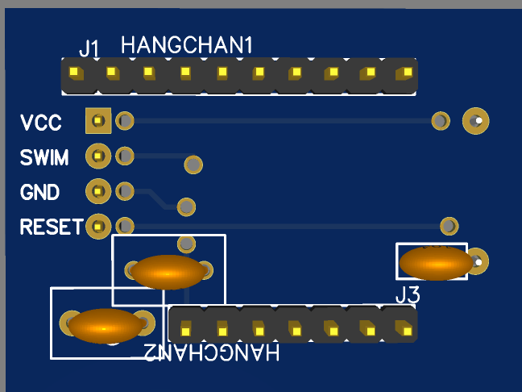
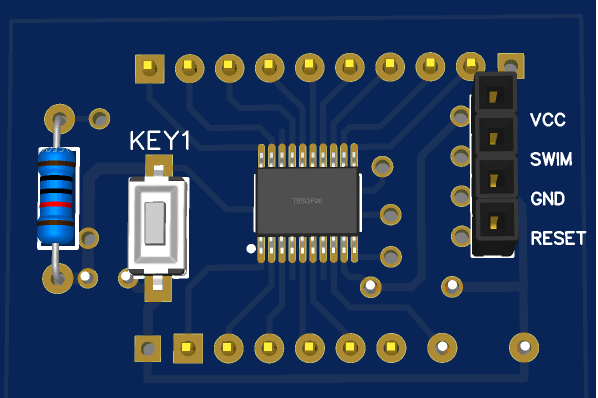
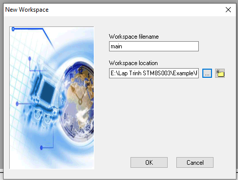
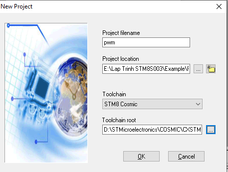
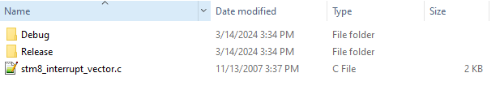
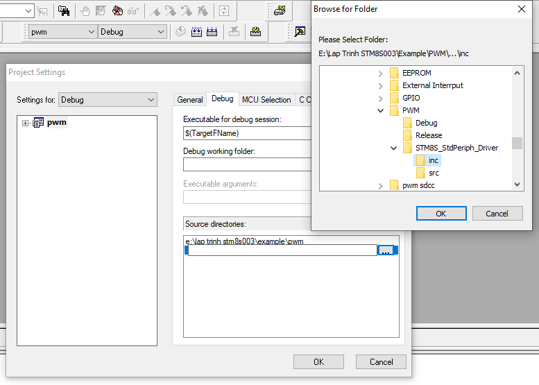
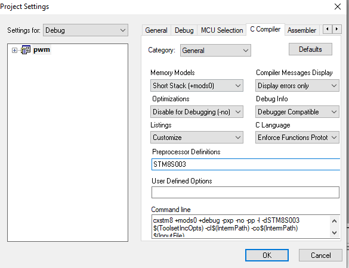
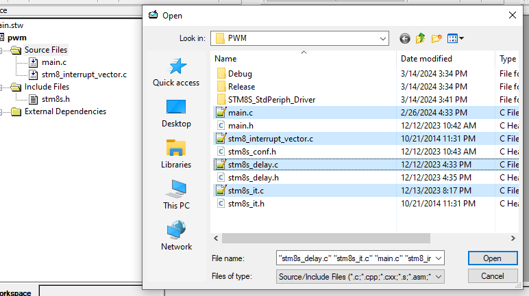
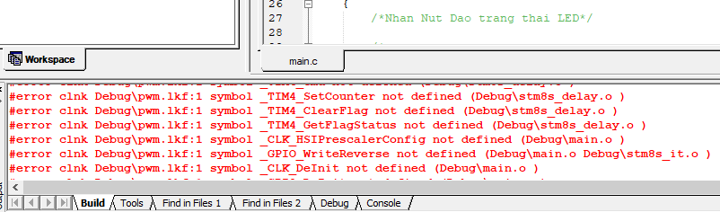
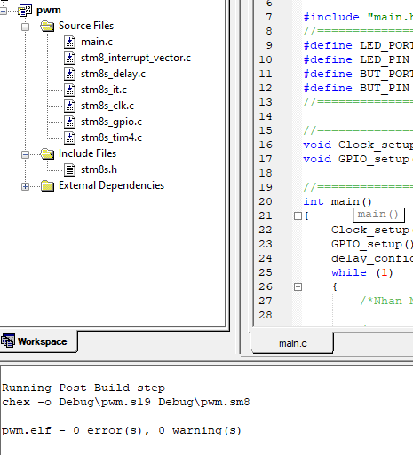

# Bước đầu lập trình STM8S

## 1. Tại sao chọn STM8S?

Sau một thời gian tiếp cận vi điều khiển họ PIC và AVR mình vẫn thấy một điều cản trở mình đi sâu vào các dòng khác thuộc 2 họ này đó là giá cả. Vì vậy mình bước qua tiếp cận họ ARM, đầu tiên là nghĩ đến STM32 vì mình đã nghe qua về nó khá nhiều. 

Tuy nhiên khi mới chập chững viết code và hiểu cấu trúc về vi điều khiển 8-bits mà phải lựa chọn sang một cấu trúc 32-bits thì không phải là điều dễ dàng, nhưng may sao tình cờ mình vô tình biết qua một họ vi điều khiển ARM cũng của hãng ST là STM8.

Không do dự mình tìm trên các web cửa hàng linh kiện để mua nó về học, ban đầu mình thấy giá nó khá rẻ so với AVR và PIC. Giá 17k cho STM8S003F3P6 tại **icdayroi** mình còn nhớ trước đó mình code trên AVR thì chỉ mua thêm 1 con Attiny24A vỏn vẹn có 2K Flash thôi mà tận 22k🙂, sót tiền vcl =))). 

Thấy số tiền bỏ ra xứng đáng vì mình đã sử hữu một con VĐK có tương đối đầy đủ các chức năng và kết nối cơ bản từ ADC, UART, I2C, SPI, v.v… khá phù hợp với người vừa ham rẻ, lại vừa đòi hỏi như mình. Mình là sinh viên biết đến VĐK không lâu nên chỉ làm một số ứng dụng cỏn con nên là sắm cho mình một con VĐK kha khá nặng đô kiểu ATMega328 hay PIC16F877A giá tầm năm – sáu chục cành một em thì mình không thích. 

Trong trường đại học, giả dụ bạn tham gia một nhóm, một phòng lab, có thể sẽ được hỗ trợ thiết bị. Nhưng nếu bạn không có điều kiện đó, hoặc chỉ là làm theo thú vui, chi phí là một vấn đề đáng lưu tâm.

Quay về VĐK STM8 này nó thuộc dòng S tên họ đầy đủ là STM8S003F3P6 20 chân đóng gói dạng SSOP-20, may mà mình cũng tiếp cận hàn từ sớm chứ không mà nghe quả đóng gói chip thế này từ đầu chắc bái bai em này😅.

        Hình dạng đóng gói của chip STM8S003F3P6:
<div style="text-align: center;">

</div>

Có một điểm đáng quan tâm ở họ STM8, đó là ST đã hỗ trợ cho người phát triển một bộ các hàm thư viện lập trình. Với STM8, mình có thể tiếp cận theo hướng lập trình thanh ghi hoặc cũng có thể đi theo hướng lập trình dựa vào thư viện. Nguồn tham khảo cho STM8 khá phổ biến do ST hỗ trợ khá tốt.

Đi vào phần lập trình cho STM8S, mình sẽ cố gắng sử dụng tối đa những ứng dụng miễn phí. Sẽ không có IAR xuất hiện ở đây vì IAR hiện tại 2023 đã không còn miễn phí. Thuở ban đầu mình chọn trình biên dịch SDCC, đây cũng là trình biên dịch giúp mình bắt đầu hiểu thêm về Makefile. 

Thực tế thì IAR hay công cụ khác thì đều có phiên bản dùng thử miễn phí, như IAR chúng ta được sử dụng miễn phí 14 ngày tuy nhiên lại bị hạn chế nhiều tính năng. Mình cũng đã nói rằng mình vừa ham rẻ, mà lại vừa đòi hỏi nhiều, nên mình không chọn chúng. 

Ngoài SDCC thì còn một trình biên dịch miễn phí khác là Cosmic C được tích hợp IDE là STVD(ST Visual Develop), SDCC không có IDE nó chỉ là trình biên dịch. Lý do chọn SDCC dù có Cosmic C miễn phí là vì mình sử dụng mạch nạp USB ISP 3.0 của anh Ngô Hùng Cường để code cho Attiny24A trước đó nên dùng mạch nạp đó nạp cho STM8S luôn. Dĩ nhiên là mạch nạp đó không thể sử dụng với ST Visual Programmer nên mình dùng SDCC biên dịch ra file hex rồi dùng tool nạp của anh Cường để nạp cho chip.

Nếu sử dụng STVD mình phải mua St-link v2, sau này mình chuyển qua học STM32 mới sắm St-link v2 thì lúc đó mình mới viết lại 1 số project dùng STVD. Nên trong các thư mục này một số Example hay Project mình có thêm 1 thư mục STVD là do mình bổ sung sau này.

Tham khảo tại: 
- [SDCC - Small Device C Compiler](https://sdcc.sourceforge.net/)
- [STVD-STM8](https://www.st.com/en/development-tools/stvd-stm8.html)

Mạch nạp USB ISP 3.0
<div style="text-align: center;">
  
</div>

Mạch nạp Stlink-v2

<div style="text-align: center;">
  
</div>

**Sơ đồ mạch ra chân tự làm:**
<div style="text-align: center;">
	
       	
</div>

Vậy là sơ qua về compile và mạch nạp, giờ mình dạo qua một số cấu hình của con này:

- Ở STM8S003 thì có bộ nhớ Flash là 8k byte dùng để lưu trữ chương trình trong khi EEPROM thì là 128 bytes dùng để lưu một số thông tin không xóa sau khi Flash hoặc mất điện. Ngoài ra nó có 1KB SRAM.
- 3 bộ Timer là Timer 1, 2, 4. Trong đó Timer 1 và 2 là thanh ghi 16-bit, timer 4 là thanh ghi 8-bit.
- Hỗ trợ giao tiếp UART, SPI, I2C, CAN
- Hỗ trợ 5 kênh ADC 10-bit
- Điện áp hoạt động 2.95V đến 5.5V 
- Thạch anh nội 16Mhz
- Còn một số tính năng khác có thể đọc thêm trong thư mục **Datasheet**

Phía trên có thư mục **Library_ST** chứa các thư viện của hãng ST cung cấp, đó là thư viện chuẩn. Mình thấy sử dụng thư viện này đã quá đủ với bộ nhớ 8Kb của con STM8S003F3P6. Với việc sử dụng các trình biên dịch khác nhau thì mình cũng phải sửa lại một chút thư viện để phù hợp, mình có để 2 tệp một dành cho SDCC và cái còn lại cho STVD.

Ngoài ra còn có một số thư viện viết cho các ngoại vi khác, có thể [tham khảo tại đây](https://github.com/timypik/STM8S-Library/tree/master)

+ Tổng quan về  lập trình STM8S mà mình gom góp được là như vậy, chi tiết các Example và Project sẽ nằm trong các thư mục.

---
**Mục Lục**
---
[Môi trường lập trình cho STM8S003F3P6 ](#A-cai-dat-moi-truong-lap-trinh)
[Thư viện sử dụng cho lập trình STM8S003](#1-các-thư-viện)
[Set dao động cho VĐK](#2-set-clock-cho-stm8s003f3p6)
[Cấu hình ngõ vào ngõ ra cho VĐK](#3-gpio)
[Cấu hình Timer cho VĐK](#4-code-cho-phần-timer)
[Cấu hình PWM ](#5-pwm)
[External Interrupt](#6-ngắt-ngoài)
[Giao tiếp UART](#7-uart)

---
## A. Cài đặt môi trường lập trình
Trong quá trình mình code STM8, mình có sử dụng 2 trình biên dịch miễn phí là COSMIC và SDCC
- Đối với SDCC mình có tìm được 1 thư mục template nên việc biên dịch đơn giản và nhanh gọn vì chỉ chạy 
lệnh "make" trên commandWindow 
- Tuy nhiên với IDE ST Visual Develop thì cần theo các bước sau mới có thể tạo project template
+ Ban đầu chọn File -> NewWorkspace 

<div style="text-align: center;">
  
</div>

+ Creater New WorkSpace

<div style="text-align: center;">
  
</div>

+ Chọn tên workSpace và thư mục chứa Project 

<div style="text-align: center;">
  
</div>

+ Ghi tên Project và chọn ToolChain STM8 Cosmic

<div style="text-align: center;">
  
</div>

+ Chọn MCU STM8S003F3P6

<div style="text-align: center;">
  
</div>

+ Cấu trúc thư mục của Project như sau, bao gồm thư viện chuẩn  Std và các file interrupt, định nghĩa vecto ngắt và file conf để thêm các header của thư viện chuẩn

<div style="text-align: center;">
  
</div>

+ Khi tạo bằng phần mềm thì thư mục sẽ trống khá nhiều nên cần copy các thư mục cần thiết 

<div style="text-align: center;">
  
</div>

+ Như thế này

<div style="text-align: center;">
  
</div>

+ Tiếp theo vào phần cài đặt Project

<div style="text-align: center;">
  
</div>

+ Ghi SMT8S003  vào mục Preprocessor

<div style="text-align: center;">
  
</div>

+ Tiếp theo add file stm8.h vào Include Files

<div style="text-align: center;">
  
</div>

+ Và add các file .c vào Source Files

<div style="text-align: center;">
  
</div>

+ Sau đó Build chương trình sẽ xuất hiện lỗi, lỗi này do chưa add file .c của GPIO và Timer, ta cần chọn Source Files và add file cần thiết

<div style="text-align: center;">
  
</div>

+ Sau khi add file nguồn gpio, timer4 và clk thì chương trình build không lỗi

<div style="text-align: center;">
  
</div>

## 1. Các thư viện
- **Nghiên cứu các thư viện này:**
```c
    #include <stdint.h>
    #include <stddef.h>
```

- Vấn đề viết thư viện cho STM8 dùng trình biên dịch SDCC và soạn thảo Visual Studio Code:
 + Để viết thư viện chúng ta 


## 2. Set Clock cho STM8S003F3P6
```C
//sử dụng clock nội 16MHZ
CLK_HSIPrescalerConfig(CLK_PRESCALER_HSIDIV1);
```
## 3. GPIO
```c
/*Khai bao chan noi den LED la output*/
GPIO_DeInit(GPIOD);
GPIO_Init(GPIOD, GPIO_PIN_3, GPIO_MODE_OUT_PP_LOW_FAST);
```
- Câu lệnh khai báo như trên có nghĩa là: 
<span style = "color : red " > 
    OUT: output, PP: push-pull, LOW: first logic is '0', FAST: Output speed up to 10 MHz  
    Tuy nhiên thời gian đáp ứng trên chân nhanh hơn sẽ tiêu tốn năng lượng nhiều hơn
</span>

[Luu y khi dung chan PB4 PB5 lam chan IO](https://www.youtube.com/watch?v=y3SxX6kZuUI&list=WL&index=82&pp=gAQBiAQB)

- Code dưới đây khai báo GPIO cho STM8S003

```c
#include "stm8s.h"  /* Using stm8s_clk.h library*/
#include "stdio.h"
uint32_t clk=0;
void mydelay(uint32_t time);

void main (void)
{
    /*Using HSI clock 16Mhz*/
    CLK_HSIPrescalerConfig(CLK_PRESCALER_HSIDIV1); 
    
    GPIO_Init(GPIOD, GPIO_PIN_3, GPIO_MODE_OUT_PP_LOW_FAST);
    clk = CLK_GetClockFreq();
    while (1)
    {
        GPIO_WriteReverse(GPIOD,GPIO_PIN_3);
        mydelay(200000);
    }
}
void mydelay(uint32_t time)
{
    while(time--);
}
```

## 4. Code cho phần Timer
#### a. Dùng timer2 để tạo delay
```C
void main (void)
{
    CLK_HSIPrescalerConfig(CLK_PRESCALER_HSIDIV1);
    GPIO_DeInit(GPIOD);
    GPIO_Init(GPIOD, GPIO_PIN_3, GPIO_MODE_OUT_PP_HIGH_FAST);
    /*TIMER2 dem len 15625 tick chiem thoi gian 500ms, 
    tuy nhien de chinh xac nen truyen vao 15624*/
    TIM2_TimeBaseInit(TIM2_PRESCALER_512, 15624);
    TIM2_ClearFlag(TIM2_FLAG_UPDATE);
    TIM2_ITConfig(TIM2_IT_UPDATE, ENABLE);
    enableInterrupts();
    TIM2_Cmd(ENABLE);
}
 //hàm ngắt
 INTERRUPT_HANDLER(TIM2_UPD_OVF_BRK_IRQHandler, 13)
 {
    GPIO_WriteReverse(GPIOD, GPIO_PIN_3);
    TIM2_ClearFlag(TIM2_FLAG_UPDATE);
 }
 ```
- Kết quả LED nháy tắt 500ms
Nếu không sử dụng hàm ngắt chúng ta kiểm tra cờ ngắt của timer2
 
 ```c
 void main (void)
 {
    TIM2_TimeBaseInit(TIM2_PRESCALER_512, 15624);
    TIM2_Cmd(ENABLE);
 }
void delay_ms(uint16_t delay)
{
    while(delay)
    {
        TIM2_SetCounter(0);
        TIM2_ClearFlag(TIM2_FLAG_UPDATE);
        while(TIM2_GetFlagStatus(TIM2_FLAG_UPDATE)== RESET){}
        --delay;
    }
}
 ```  
 
#### b.Dùng timer4 để tạo delay
```c
uint16_t i = 0;
void main (void)
{
    /*Thet lap ngat cho timer4*/
    TIM4_TimeBaseInit(TIM4_PRESCALER_128, 125 - 1);
    TIM4_SetCounter(0);
    TIM4_ClearFlag(TIM4_FLAG_UPDATE);
    TIM4_ITConfig(TIM4_IT_UPDATE, ENABLE);
    enableInterrupts();
    TIM4_Cmd(ENABLE);
}

/*----------------Ngat timer4------------*/
 INTERRUPT_HANDLER(TIM4_UPD_OVF_IRQHandler, 23)
 {
    TIM4_SetCounter(0);
    TIM4_ClearFlag(TIM4_FLAG_UPDATE);
    i++;
    if(i>500)
    {
      GPIO_WriteReverse(GPIOD, GPIO_PIN_3);
      i=0;
    }
 }  
```
Nếu không sử dụng hàm ngắt
```c
void main(void)
{
    TIM4_TimeBaseInit(TIM4_PRESCALER_128, 125 - 1);
    TIM4_Cmd(ENABLE);
}
void delay_ms(uint16_t u16Delay)
{
    while (u16Delay) {
        TIM4_SetCounter(0);
        TIM4_ClearFlag(TIM4_FLAG_UPDATE);
        while (TIM4_GetFlagStatus(TIM4_FLAG_UPDATE) == RESET) {}
        --u16Delay;
    }
}
```
## 5. PWM
[Tham khao](https://www.youtube.com/watch?v=2wEJFeGk3G4&list=WL&index=82)

## 6. Ngắt ngoài
```c
void main(void)
{
    /*ngat ngoai*/
    EXTI_DeInit();
    GPIO_Init(GPIOD, GPIO_PIN_4, GPIO_MODE_IN_PU_IT);
    EXTI_SetExtIntSensitivity(EXTI_PORT_GPIOD, EXTI_SENSITIVITY_FALL_ONLY);
    enableInterrupts();
}
 /*-----------Ham ngat ngoai-------------*/
INTERRUPT_HANDLER(EXTI_PORTD_IRQHandler, 6)
{
  GPIO_WriteReverse(GPIOD, GPIO_PIN_3);
}
```
Hàm ngắt ngoài nhưng có chống dội nút nhấn
```php
/*---------Ngat ngoai tai chan PD4----------*/
INTERRUPT_HANDLER(EXTI_PORTD_IRQHandler, 6)
{
  if(GPIO_ReadInputPin(GPIOD, GPIO_PIN_4)==0)
  {
    delay_ms(100);
    while(GPIO_ReadInputPin(GPIOD, GPIO_PIN_4)==0){}
    GPIO_WriteReverse(GPIOD, GPIO_PIN_3);
    dem++;
    if (dem>9)dem=0;
  }
}
```

## 7. UART
Linh tham khảo
<https://circuitdigest.com/microcontroller-projects/serial-monitor-on-stm8s-using-cosmic-and-stvd>
<https://b4050n.wordpress.com/2017/05/03/stm8s-8-1-wire-bus-tren-stm8s/>

1. https://laptrinharmst.blogspot.com/2022/03/13-flash-va-eeprom-trong-stm8s.html
2. https://deviot.vn/tutorials/avr.07957098/giao-tiep-1-wire-voi-cam-bien-nhiet-do-ds18b20.15391999
3. https://laptrinharmst.blogspot.com/2017/12/bai-01-huong-dan-tao-project-trong.html
4. http://laptrinharmst.blogspot.com/2018/01/timer-base-va-ngat-timer.html
5. http://laptrinharmst.blogspot.com/2018/01/bai-11-i2c-voi-ic-ds1307.html
6. https://www.slideshare.net/gouravkumar220/build-process-in-st-visual-develop
7. https://www.slideshare.net/huynhvany/huong-dan-su-dung-iar-cho-stm820-feb2013
8. https://circuitdigest.com/microcontroller-projects/i2c-communication-on-stm8s-using-cosmic-c-compiler-reading-mlx90614-sensor-values
9. https://www.edaboard.com/threads/stm8s003-getting-reset-with-noise.369663/
10. https://circuitdigest.com/tags/stm8
11. https://b4050n.wordpress.com/2016/12/17/stm8s-0-khoi-dau-voi-stm8s-tren-linux/
12. https://b4050n.wordpress.com/2017/05/03/stm8s-8-1-wire-bus-tren-stm8s/


