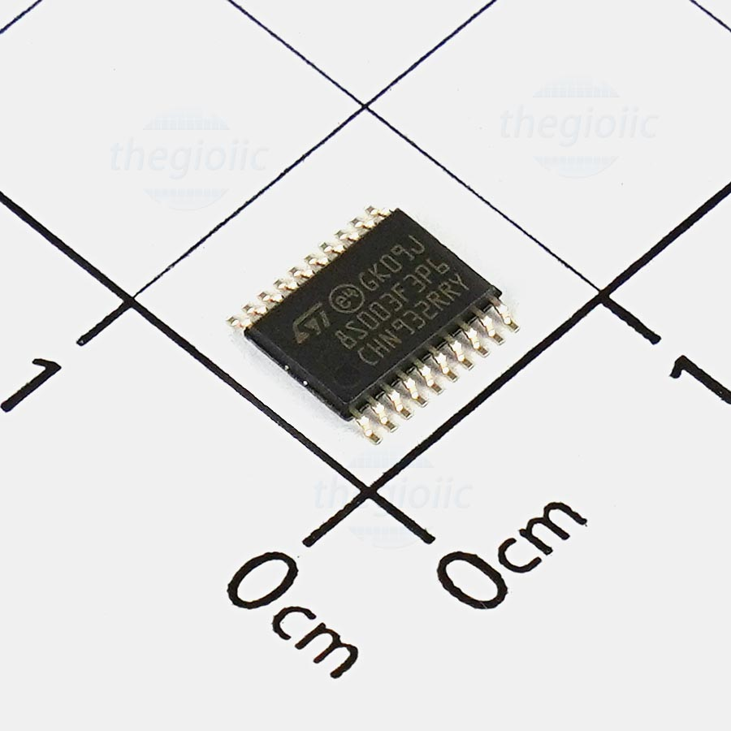

# Bước đầu lập trình STM8S

## 1. Tại sao chọn STM8S?

Sau một thời gian tiếp cận vi điều khiển họ PIC và AVR mình vẫn thấy một điều cản trở mình đi sâu vào các dòng khác thuộc 2 họ này đó là giá cả. Vì vậy mình bước qua tiếp cận họ ARM, đầu tiên là nghĩ đến STM32 vì mình đã nghe qua về nó khá nhiều. 

Tuy nhiên khi mới chập chững viết code và hiểu cấu trúc về vi điều khiển 8-bits mà phải lựa chọn sang một cấu trúc 32-bits thì không phải là điều dễ dàng, nhưng may sao tình cờ mình vô tình biết qua một họ vi điều khiển ARM cũng của hãng ST là STM8.

Không do dự mình tìm trên các web cửa hàng linh kiện để mua nó về học, ban đầu mình thấy giá nó khá rẻ so với AVR và PIC. Giá 17k cho STM8S003F3P6 tại **icdayroi** mình còn nhớ trước đó mình code trên AVR thì chỉ mua thêm 1 con Attiny24A vỏn vẹn có 2K Flash thôi mà tận 22k🙂, sót tiền vcl =))). 

Thấy số tiền bỏ ra xứng đáng vì mình đã sử hữu một con VĐK có tương đối đầy đủ các chức năng và kết nối cơ bản từ ADC, UART, I2C, SPI, v.v… khá phù hợp với người vừa ham rẻ, lại vừa đòi hỏi như mình. Mình là sinh viên biết đến VĐK không lâu nên chỉ làm một số ứng dụng cỏn con nên là sắm cho mình một con VĐK kha khá nặng đô kiểu ATMega328 hay PIC16F877A giá tầm năm – sáu chục cành một em thì mình không thích. 

Trong trường đại học, giả dụ bạn tham gia một nhóm, một phòng lab, có thể sẽ được hỗ trợ thiết bị. Nhưng nếu bạn không có điều kiện đó, hoặc chỉ là làm theo thú vui, chi phí là một vấn đề đáng lưu tâm.

Quay về VĐK STM8 này nó thuộc dòng S tên họ đầy đủ là STM8S003F3P6 20 chân đóng gói dạng SSOP-20, may mà mình cũng tiếp cận hàn từ sớm chứ không mà nghe quả đóng gói chip thế này từ đầu chắc bái bai em này🙂.

>>>>>>> Hình dạng đóng gói của chip STM8S003F3P6:




*Các branch là các bài code cơ bản trước khi tìm hiểu một vi điều khiển mới bao gồm GPIO, Timer, Ngắt ngoài, giao tiếp UART, I2C, SPI, ...Ngoài ra kèm theo code là tài liệu của chip và phần chạy code trong thực tế*


[Thư viện tham khảo ](https://github.com/timypik/STM8S-Library/tree/master)

---
**Mục Lục**
---
[Thư viện sử dụng cho lập trình STM8S003](#1-các-thư-viện)
[Set dao động cho VĐK](#2-set-clock-cho-stm8s003f3p6)
[Cấu hình ngõ vào ngõ ra cho VĐK](#3-gpio)
[Cấu hình Timer cho VĐK](#4-code-cho-phần-timer)
[Cấu hình PWM ](#5-pwm)
[External Interrupt](#6-ngắt-ngoài)
[Giao tiếp UART](#7-uart)

---
## 1. Các thư viện
- **Nghiên cứu các thư viện này:**
```c
    #include <stdint.h>
    #include <stddef.h>
```

- Vấn đề viết thư viện cho STM8 dùng trình biên dịch SDCC và soạn thảo Visual Studio Code:
 + Để viết thư viện chúng ta 


## 2. Set Clock cho STM8S003F3P6
```C
//sử dụng clock nội 16MHZ
CLK_HSIPrescalerConfig(CLK_PRESCALER_HSIDIV1);
```
## 3. GPIO
```c
/*Khai bao chan noi den LED la output*/
GPIO_DeInit(GPIOD);
GPIO_Init(GPIOD, GPIO_PIN_3, GPIO_MODE_OUT_PP_LOW_FAST);
```
- Câu lệnh khai báo như trên có nghĩa là: 
<span style = "color : red " > 
    OUT: output, PP: push-pull, LOW: first logic is '0', FAST: Output speed up to 10 MHz  
    Tuy nhiên thời gian đáp ứng trên chân nhanh hơn sẽ tiêu tốn năng lượng nhiều hơn
</span>

[Luu y khi dung chan PB4 PB5 lam chan IO](https://www.youtube.com/watch?v=y3SxX6kZuUI&list=WL&index=82&pp=gAQBiAQB)

- Code dưới đây khai báo GPIO cho STM8S003

```c
#include "stm8s.h"  /* Using stm8s_clk.h library*/
#include "stdio.h"
uint32_t clk=0;
void mydelay(uint32_t time);

void main (void)
{
    /*Using HSI clock 16Mhz*/
    CLK_HSIPrescalerConfig(CLK_PRESCALER_HSIDIV1); 
    
    GPIO_Init(GPIOD, GPIO_PIN_3, GPIO_MODE_OUT_PP_LOW_FAST);
    clk = CLK_GetClockFreq();
    while (1)
    {
        GPIO_WriteReverse(GPIOD,GPIO_PIN_3);
        mydelay(200000);
    }
}
void mydelay(uint32_t time)
{
    while(time--);
}
```

## 4. Code cho phần Timer
#### a. Dùng timer2 để tạo delay
```C
void main (void)
{
    CLK_HSIPrescalerConfig(CLK_PRESCALER_HSIDIV1);
    GPIO_DeInit(GPIOD);
    GPIO_Init(GPIOD, GPIO_PIN_3, GPIO_MODE_OUT_PP_HIGH_FAST);
    /*TIMER2 dem len 15625 tick chiem thoi gian 500ms, 
    tuy nhien de chinh xac nen truyen vao 15624*/
    TIM2_TimeBaseInit(TIM2_PRESCALER_512, 15624);
    TIM2_ClearFlag(TIM2_FLAG_UPDATE);
    TIM2_ITConfig(TIM2_IT_UPDATE, ENABLE);
    enableInterrupts();
    TIM2_Cmd(ENABLE);
}
 //hàm ngắt
 INTERRUPT_HANDLER(TIM2_UPD_OVF_BRK_IRQHandler, 13)
 {
    GPIO_WriteReverse(GPIOD, GPIO_PIN_3);
    TIM2_ClearFlag(TIM2_FLAG_UPDATE);
 }
 ```
- Kết quả LED nháy tắt 500ms
Nếu không sử dụng hàm ngắt chúng ta kiểm tra cờ ngắt của timer2
 
 ```c
 void main (void)
 {
    TIM2_TimeBaseInit(TIM2_PRESCALER_512, 15624);
    TIM2_Cmd(ENABLE);
 }
void delay_ms(uint16_t delay)
{
    while(delay)
    {
        TIM2_SetCounter(0);
        TIM2_ClearFlag(TIM2_FLAG_UPDATE);
        while(TIM2_GetFlagStatus(TIM2_FLAG_UPDATE)== RESET){}
        --delay;
    }
}
 ```  
 
#### b.Dùng timer4 để tạo delay
```c
uint16_t i = 0;
void main (void)
{
    /*Thet lap ngat cho timer4*/
    TIM4_TimeBaseInit(TIM4_PRESCALER_128, 125 - 1);
    TIM4_SetCounter(0);
    TIM4_ClearFlag(TIM4_FLAG_UPDATE);
    TIM4_ITConfig(TIM4_IT_UPDATE, ENABLE);
    enableInterrupts();
    TIM4_Cmd(ENABLE);
}

/*----------------Ngat timer4------------*/
 INTERRUPT_HANDLER(TIM4_UPD_OVF_IRQHandler, 23)
 {
    TIM4_SetCounter(0);
    TIM4_ClearFlag(TIM4_FLAG_UPDATE);
    i++;
    if(i>500)
    {
      GPIO_WriteReverse(GPIOD, GPIO_PIN_3);
      i=0;
    }
 }  
```
Nếu không sử dụng hàm ngắt
```c
void main(void)
{
    TIM4_TimeBaseInit(TIM4_PRESCALER_128, 125 - 1);
    TIM4_Cmd(ENABLE);
}
void delay_ms(uint16_t u16Delay)
{
    while (u16Delay) {
        TIM4_SetCounter(0);
        TIM4_ClearFlag(TIM4_FLAG_UPDATE);
        while (TIM4_GetFlagStatus(TIM4_FLAG_UPDATE) == RESET) {}
        --u16Delay;
    }
}
```
## 5. PWM
[Tham khao](https://www.youtube.com/watch?v=2wEJFeGk3G4&list=WL&index=82)

## 6. Ngắt ngoài
```c
void main(void)
{
    /*ngat ngoai*/
    EXTI_DeInit();
    GPIO_Init(GPIOD, GPIO_PIN_4, GPIO_MODE_IN_PU_IT);
    EXTI_SetExtIntSensitivity(EXTI_PORT_GPIOD, EXTI_SENSITIVITY_FALL_ONLY);
    enableInterrupts();
}
 /*-----------Ham ngat ngoai-------------*/
INTERRUPT_HANDLER(EXTI_PORTD_IRQHandler, 6)
{
  GPIO_WriteReverse(GPIOD, GPIO_PIN_3);
}
```
Hàm ngắt ngoài nhưng có chống dội nút nhấn
```php
/*---------Ngat ngoai tai chan PD4----------*/
INTERRUPT_HANDLER(EXTI_PORTD_IRQHandler, 6)
{
  if(GPIO_ReadInputPin(GPIOD, GPIO_PIN_4)==0)
  {
    delay_ms(100);
    while(GPIO_ReadInputPin(GPIOD, GPIO_PIN_4)==0){}
    GPIO_WriteReverse(GPIOD, GPIO_PIN_3);
    dem++;
    if (dem>9)dem=0;
  }
}
```

## 7. UART
Linh tham khảo
<https://circuitdigest.com/microcontroller-projects/serial-monitor-on-stm8s-using-cosmic-and-stvd>
<https://b4050n.wordpress.com/2017/05/03/stm8s-8-1-wire-bus-tren-stm8s/>
