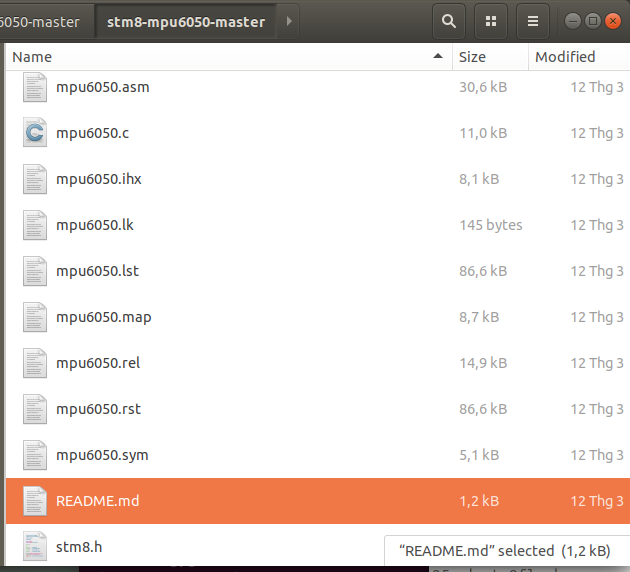
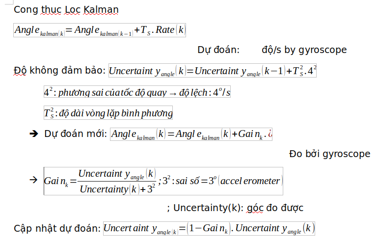
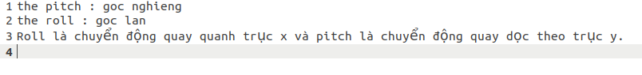

## MPU6050 for STM8S003F3P6

https://doi.org/10.21070/joincs.v1i1.799

cong thuc loc kalman

Reference

https://controllerstech.com/how-to-interface-mpu6050-gy-521-with-stm32/?fbclid=IwAR0rtvdES5pxrRzup_NfBqz772-nSDD5U-Gs_T7aV57vOcEUKHNxTYU3lQc

https://github.com/yuewuo/stm8-mpu6050/tree/master

